# Flow Diagrams

## Overview

This document contains detailed flow diagrams for key processes in the banking system using Mermaid syntax.

## 1. User Registration Flow

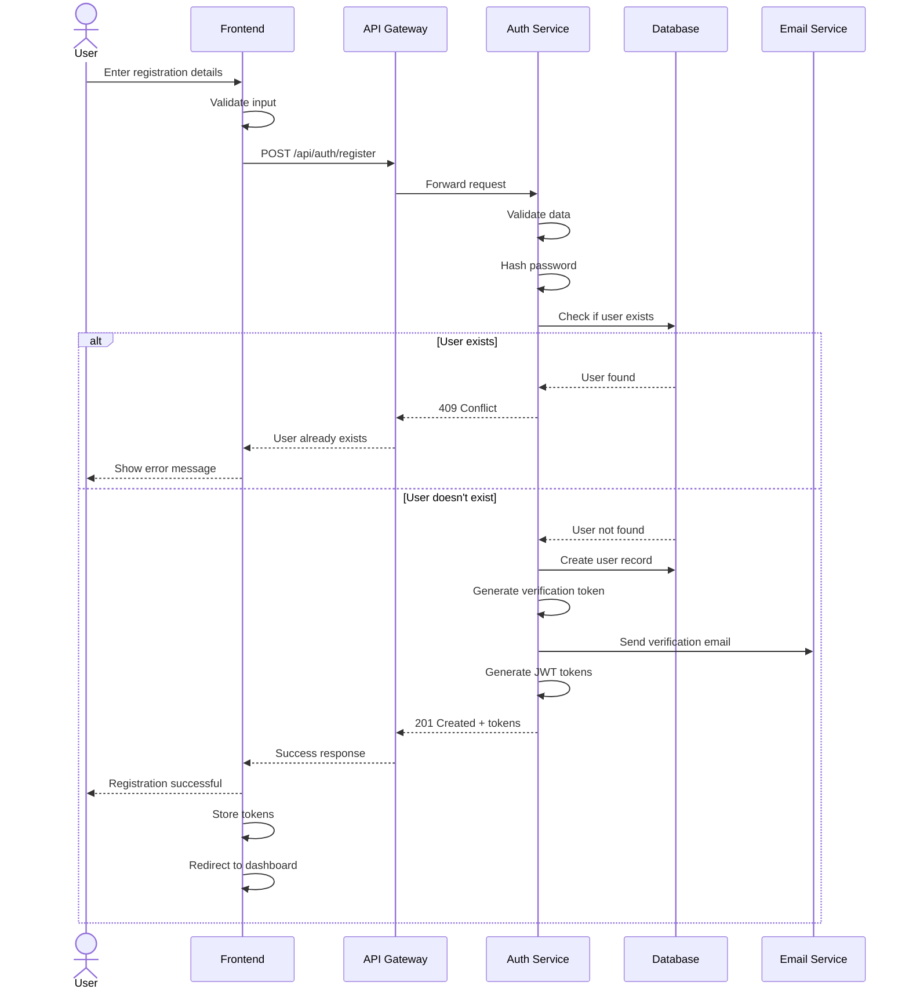

## 2. User Login Flow

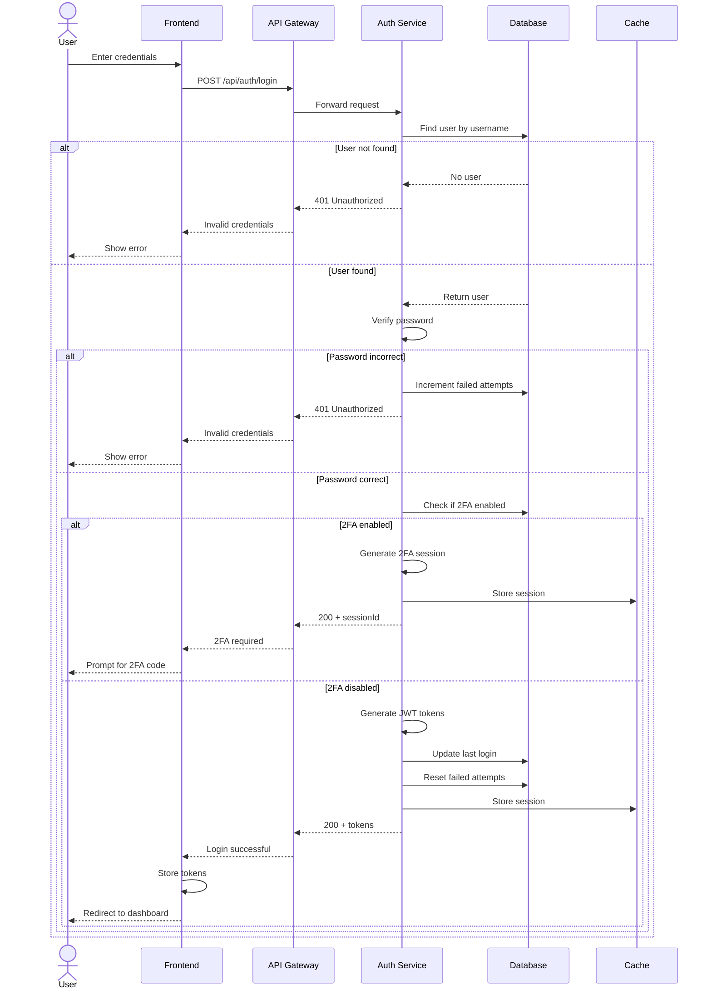

## 3. Account Creation Flow

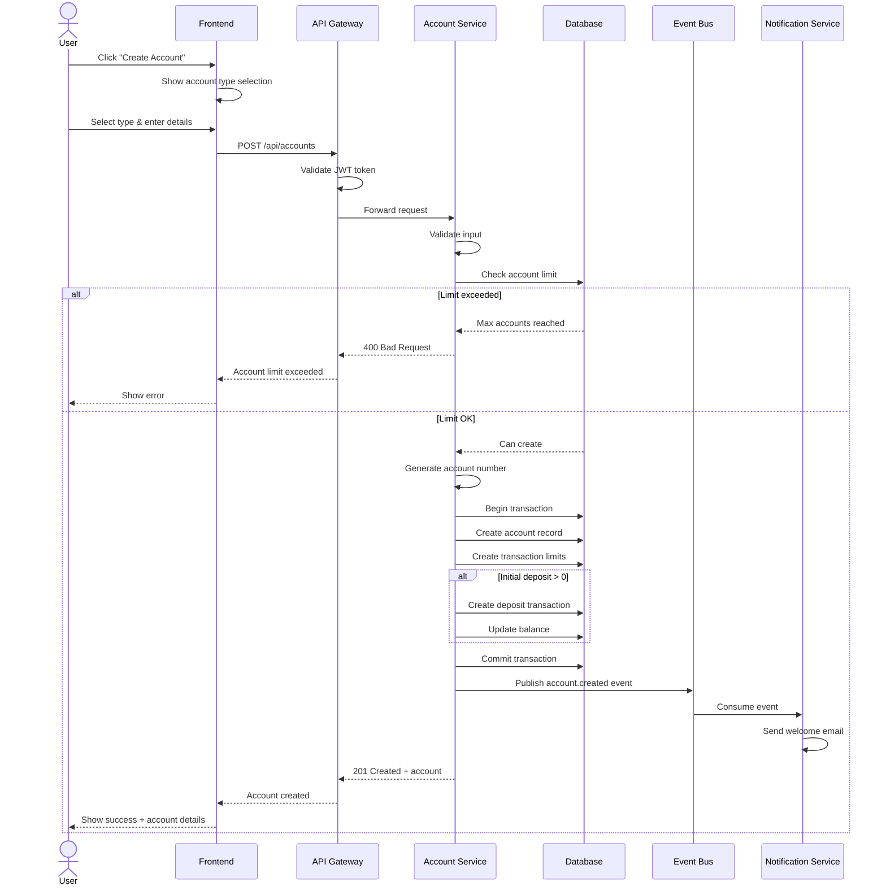

## 4. Fund Transfer Flow

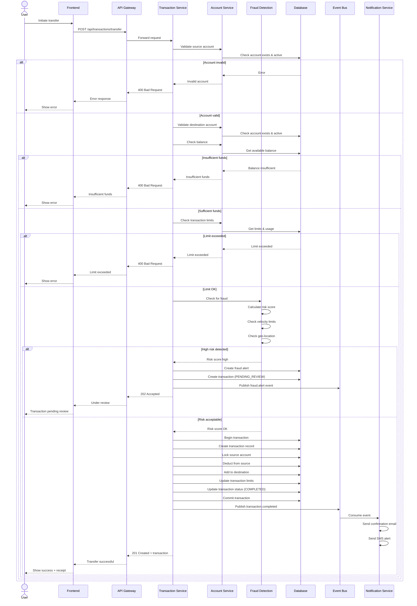

## 5. External Transfer Flow

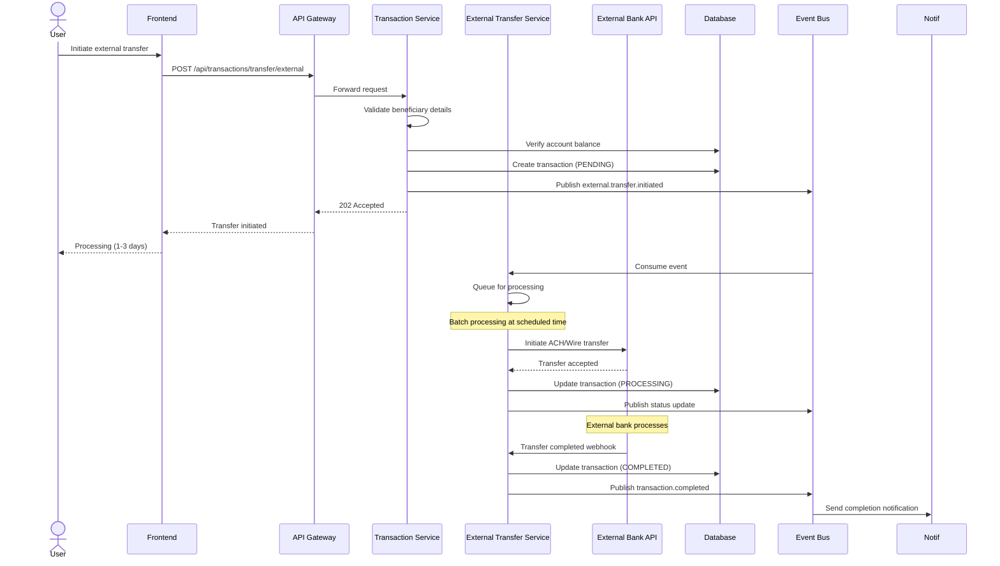

## 6. Recurring Payment Flow

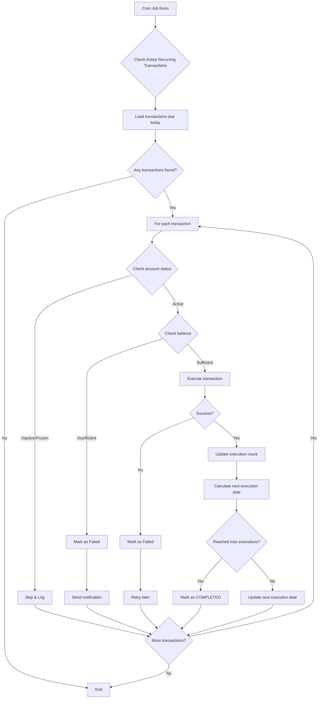

## 7. Fraud Detection Flow

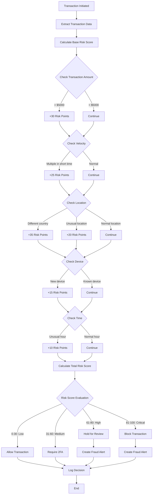

## 8. Password Reset Flow

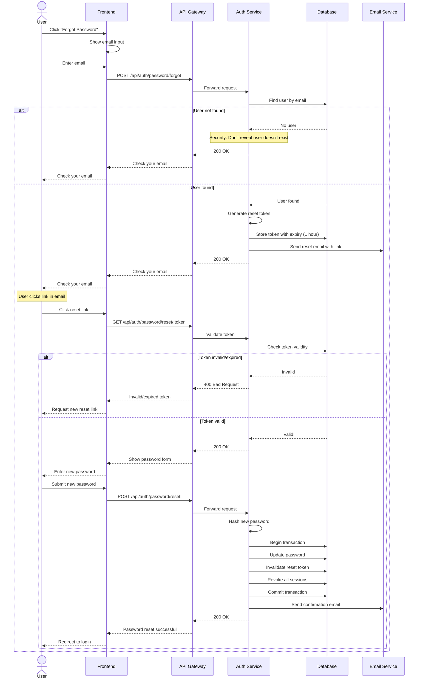

## 9. Account Statement Generation Flow

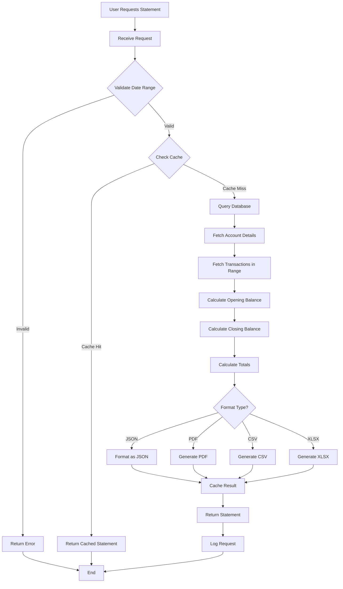

## 10. Session Management Flow

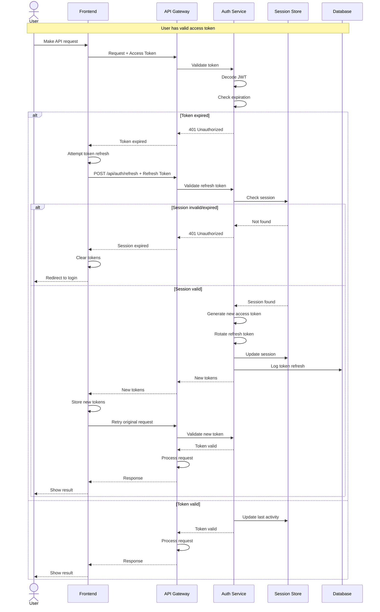

## 11. Transaction Rollback Flow

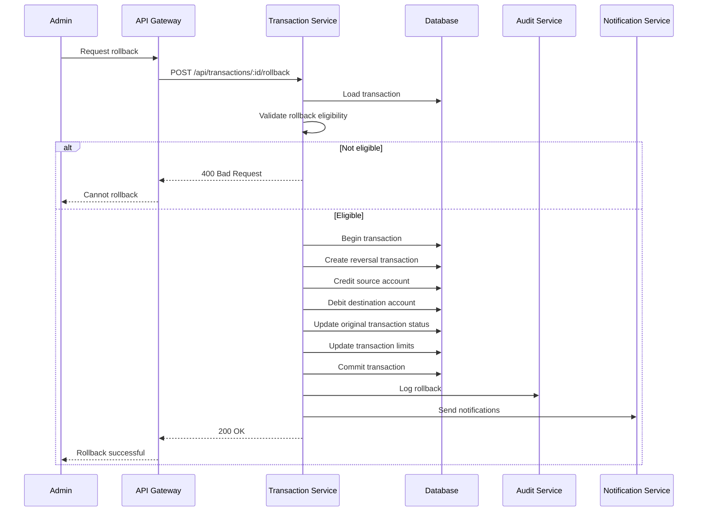

## 12. System Health Check Flow

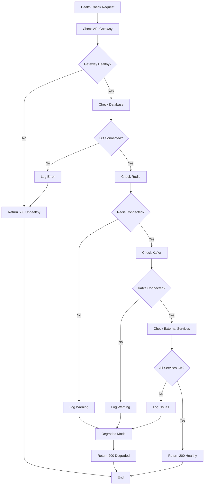

These flow diagrams provide a comprehensive visual representation of the key processes in the banking system, making it easier to understand the system's behavior and interactions between components.